# FLUTTER

## Création d'un nouveau projet

- Ouvrez un dossier VS Code, accédez à la palette de commandes et sélectionnez Flutter : Nouveau projet . 
- Choisissez ensuite Application et indiquez l'emplacement et le nom de votre projet. 

Vous pouvez maintenant commencer à développer votre application Flutter. Pour émuler le code, sélectionnez le fichier main.dart dans le dossier lib. Ce fichier est le point d'entrée de l'exécution de l'application. Vous pouvez lancer l'émulation en appuyant sur F5 et en sélectionnant Flutter : Lancer l'émulateur . L'émulateur s'ouvrira et affichera le résultat de votre code.

### Création de Hello Flutter

- Supprimez le widget MyHomePage du fichier main.dart. 
- Créez un nouveau widget sans état appelé HelloFlutter. 

Les widgets sans état sont des widgets qui n'ont pas à gérer les changements d'état interne. Ils sont généralement utilisés pour créer des composants qui, une fois dessinés, n'ont plus besoin d'être mis à jour.

- Remplacez le widget Container par un widget Scaffold : un Scaffold est un framework de mise en page visuelle fondamental de Material Design. 

Ce widget inclut des API permettant d'afficher les tiroirs, les barres d'application et le corps de l'application. La propriété body du Scaffold sera utilisée pour afficher le contenu de l'application ici.

- Déclarez un widget conteneur dans le corps du scaffold.

Ces points concernant la création de Hello Flutter font suite à la page précédente.

- Un widget conteneur est un widget pratique qui combine des widgets populaires de dessin, de positionnement et de dimensionnement. Vous pouvez contrôler les caractéristiques mentionnées ci-dessus en encapsulant n'importe quel widget dans un conteneur.

- Le widget Container possède un attribut d'alignement qui peut être utilisé pour centrer le widget à l'écran.

- Déclarez un widget Texte dans la propriété enfant du widget Conteneur : le widget Texte permet d’afficher et de manipuler du texte. Une fois le widget Texte créé, saisissez « Hello Flutter » entre guillemets simples. Le widget Texte affichera tout ce qui est saisi entre guillemets.

- Ensuite, dans la classe principale MyApp ci-dessus, mettez à jour la propriété home de MyHomePage(...) à HelloFlutter(). Cela permet à la classe MyApp principale de faire référence à l'objet HelloFlutter nouvellement généré.

```dart
import 'package:flutter/material.dart';

void main() {
  runApp(const MyApp());
}

class MyApp extends StatelessWidget {
  const MyApp({super.key});

  // This widget is the root of your application.
  @override
  Widget build(BuildContext context) {
    return MaterialApp(
      title: 'Flutter Demo',
      theme: ThemeData(
        colorScheme: ColorScheme.fromSeed(seedColor: Colors.deepPurple),
      ),
      home: const HelloFlutter(),
    );
  }
}

class HelloFlutter extends StatelessWidget {
  const HelloFlutter({ super.key });

   @override
  Widget build(BuildContext context) {
    return Scaffold(
      body: Container(
        alignment: Alignment.center,
        child: const Text('Hello Flutter')
      ),
    );
  }
}
```

- rendu

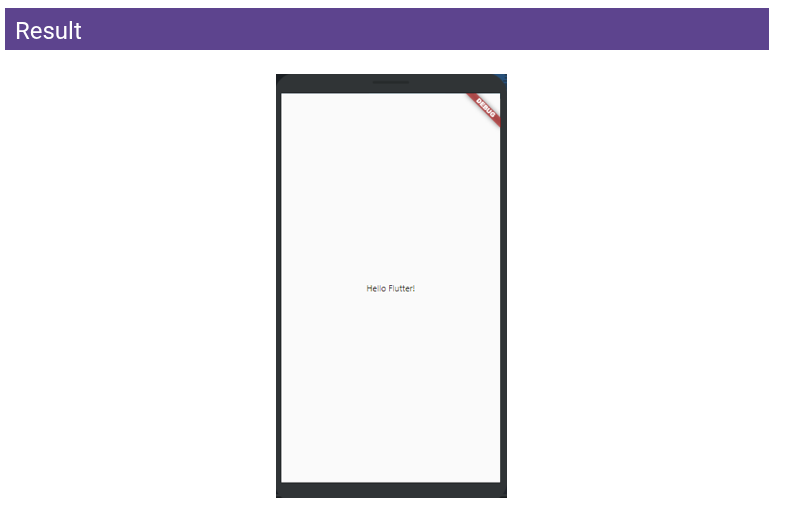


## Classe d'icône Flutter

```dart
import 'package:flutter/material.dart';

void main() {
  runApp(TabBarDemo());
}

class TabBarDemo extends StatelessWidget {
  const TabBarDemo({super.key});

  @override
  Widget build(BuildContext context) {
    return MaterialApp(
      home: DefaultTabController(
        length: 5,
        child: Scaffold(
          appBar: AppBar(
            bottom: TabBar(
              tabs: [
                Tab(icon: Icon(Icons.music_note)),
                Tab(icon: Icon(Icons.music_video)),
                Tab(icon: Icon(Icons.camera_alt)),
                Tab(icon: Icon(Icons.grade)),
                Tab(icon: Icon(Icons.email)),
              ]
            ),
            title: Text('Icon class Test'),
            backgroundColor: Colors.green,
          ),
          body: TabBarView(
            children: [
              Icon(Icons.music_note, size: 100),
              Icon(Icons.music_video, color: Colors.blue, size: 100),
              Icon(Icons.camera_alt, semanticLabel: 'Camera', size: 100),
              Icon(Icons.grade, color: Colors.red, size: 300, semanticLabel: 'Star'),
              Icon(Icons.email)
            ]
          ),
        ),
      )
    );
  }
}
```

- rendu

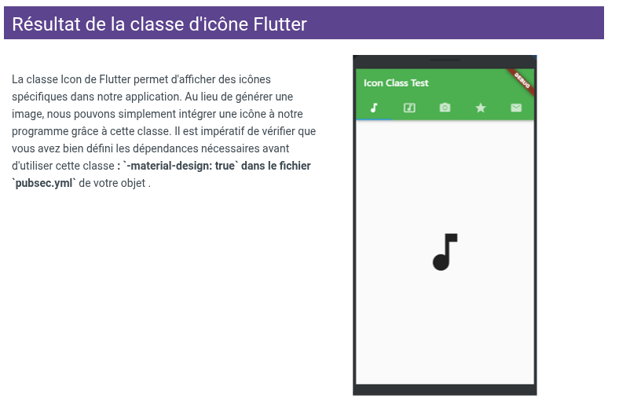

## Widget de classe et de boîte de dialogue Flutter Expanded

### Classe étendue Flutter

Lors de la création d'un élément enfant d'une ligne ou d'une colonne, sa taille est définie en fonction de la taille de l'écran. Cependant, si cet élément est plus grand que l'écran, un avertissement s'affiche et l'élément sort de l'écran. Pour résoudre ce problème, l'élément enfant est placé dans un widget étendu afin qu'il n'occupe que l'espace disponible sur l'axe principal. Lorsque plusieurs éléments enfants sont créés, l'espace disponible entre eux est réparti en fonction du facteur de flexibilité. Un widget étendu ne contient que des widgets avec ou sans état ; aucun autre type de widget, tel que les widgets RenderObjectWidget, n'est autorisé.


```dart
void main() {
  runApp(TabBarDemo());
}


class TabBarDemo extends StatelessWidget {
  const TabBarDemo({super.key});

  @override
  Widget build(BuildContext context) {
    return MaterialApp(
      home: AlertDialog(
        title: Text('Welcome'),
        content: Text('This is an alert'),
        actions: [
          TextButton(
            onPressed: () {}, 
            child: Text('CANCEL')
          ),
          TextButton(
            onPressed: () {}, 
            child: Text('ACCEPT')
          )
        ],
      )
    );
  }
}
```

- rendu

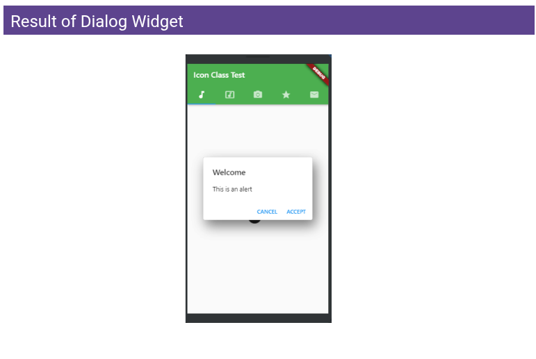

## Indicateurs de progression Flutter

Dans chaque programme, l'indicateur de progression affiche le temps nécessaire à l'exécution de différents processus tels que le téléchargement, l'installation, le chargement, le transfert de fichiers, etc. Il permet de visualiser l'avancement d'une tâche ou la durée des opérations. Dans Flutter, la progression peut être affichée de deux manières :

- Indicateur de progression circulaire : Un indicateur de progression circulaire est un widget affichant la progression sous forme de cercle. Il s'agit d'un indicateur de progression circulaire qui tourne, indiquant que l'application est en cours d'exécution ou en attente.
- Indicateur de progression linéaire : Un indicateur de progression linéaire, souvent appelé barre de progression, est un widget qui affiche la progression de manière linéaire pour indiquer que le programme est en cours d'exécution.

Les indicateurs de progrès sont classés en deux types

- Indéterminé : Un indicateur de progression indéterminé n’affiche aucune valeur précise à un instant donné, mais indique simplement que la progression est en cours. Il n’indique pas le niveau de progression atteint. Nous avons défini l’attribut « value » sur « null » pour créer une barre de progression indéfinie.

- Indicateur de progression déterminé : Un indicateur de progression déterminé possède une valeur spécifique à chaque instant. Il indique également le niveau d’avancement. Sa valeur augmente de manière monotone de 0 à 1, 0 indiquant un début de progression et 1 une progression achevée.

### Programmation des indicateurs de progression Flutter

```dart
import 'package:flutter/material.dart';

void main() {
  runApp(MyApp());
}


class MyApp extends StatelessWidget {
  const MyApp({super.key});

  @override
  Widget build(BuildContext context) {
    return MaterialApp(
      debugShowCheckedModeBanner: false,
      home: Loader(),
    );
  }
}


class Loader extends StatelessWidget {
  const Loader({ super.key });

  @override
  Widget build(BuildContext context) {
    return Scaffold(
      appBar: AppBar(
        title: Text('ProgressIndicators'),
        backgroundColor: Color(0xFF4CAF50),
        centerTitle: true,
      ),

      body: Center(
        child: Column(
          mainAxisAlignment: MainAxisAlignment.center,
          children: [
            CircularProgressIndicator(
              backgroundColor: Colors.redAccent,
              valueColor: AlwaysStoppedAnimation(Colors.green),
              strokeWidth: 10,
            ),
            SizedBox(
              height: 15,
            ),
            LinearProgressIndicator(
              backgroundColor: Colors.redAccent,
              valueColor: AlwaysStoppedAnimation(Colors.green),
              minHeight: 20,
            )
          ],
        ),
      ),
    );
  }
}
```

- rendy

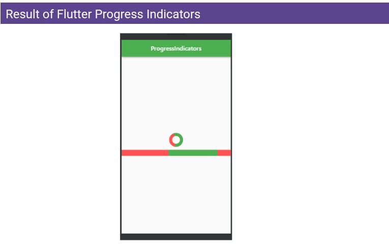


## Personnalisation des polices dans Flutter

```dart
import 'package:flutter/material.dart';

void main() => runApp(const MyApp());


class MyApp extends StatelessWidget {
  const MyApp({super.key});

  @override
  Widget build(BuildContext context) {
    return MaterialApp(
      home: Scaffold(
        appBar: AppBar(
          title: Text('CostumFonts'),
          backgroundColor: Colors.green,
        ),

        body: const SafeArea(
          child: Center(
            child: Text(
              'New Fonts',
              style: TextStyle(
                fontSize: 40.0,
                color: Colors.green,
                fontWeight: FontWeight.bold
              ),
            ),
          )
        )
      ),
    );
  }
}
```

- rendu

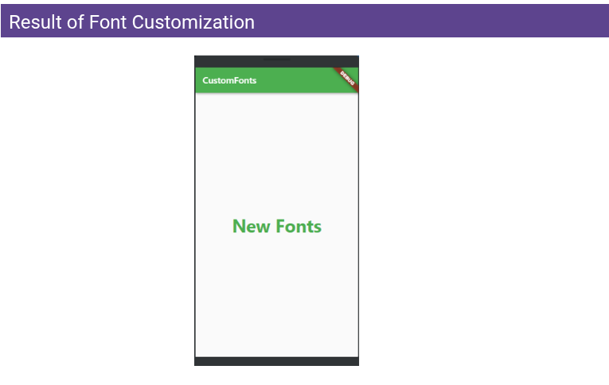


## Écrire le code pour les widgets Flutter

Écrire le code pour les widgets Flutter
Dans une application Flutter, chaque élément affiché à l'écran est un widget. L'apparence de l'écran est entièrement déterminée par les widgets utilisés pour concevoir l'application et par l'ordre dans lequel ils sont utilisés. La structure du code d'une application est une arborescence de widgets. Il existe deux types de widgets dans Flutter : les widgets avec état et les widgets sans état.

```dart
import 'package:flutter/material.dart';

void main() => runApp(const MyApp());


class MyApp extends StatefulWidget {
  const MyApp({super.key});

  @override
  // ignore: library_private_types_in_public_api
  _MyAppState createState() => _MyAppState();
}


class _MyAppState extends State<MyApp> {
  @override
  Widget build(BuildContext context) {
    return MaterialApp(
      home: Scaffold(
        backgroundColor: Colors.lightGreen,
        appBar: AppBar(
          backgroundColor: Colors.green,
          title: const Text('Flutter Test'),
        ),

        body: Center(
          child: Text('Hello World'),
        )
      )
    );
  }
}
```

- rendu

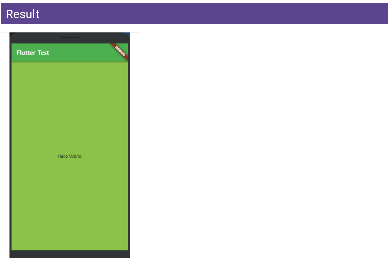


## Écriture de code pour une classe de conteneur Flutter

```dart
import 'package:flutter/material.dart';

void main() => runApp(const MyApp());


class MyApp extends StatelessWidget {
  const MyApp({super.key});

  @override
  Widget build(BuildContext context) {
    return MaterialApp(
      home: Scaffold(
        appBar: AppBar(
          title: const Text('Container Example'),
        ),

        body: Container(
          height: 200,
          width: double.infinity,
          color: Colors.purple,
          alignment: Alignment.center,
          margin: const EdgeInsets.all(20),
          padding: const EdgeInsets.all(30),
          transform: Matrix4.rotationZ(0.1),
          child: const Text(
            'this i a Container',
            style: TextStyle(
              fontSize: 20
            ),
          ),
        )
      )
    );
  }
}
```

Dans Flutter, la classe Container est un widget pratique qui combine les fonctionnalités classiques de dessin, de placement et de mise à l'échelle des widgets. Un conteneur peut contenir un ou plusieurs widgets et les agencer à l'écran selon les besoins. Un conteneur est essentiellement une boîte servant à contenir des éléments. Une marge sépare le conteneur actuel de son contenu externe dans un élément conteneur de base qui héberge un widget. Le conteneur peut avoir une bordure de différentes formes, comme des rectangles arrondis. Le remplissage d'un conteneur enveloppe son enfant et applique des restrictions supplémentaires à son étendue (en intégrant la largeur et la hauteur comme contraintes si l'une d'elles est non nulle).

- rendu

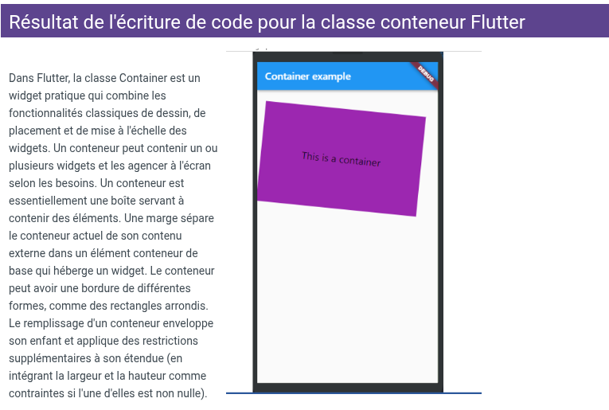


## Classe de base Flutter

Scaffold est une classe Flutter offrant de nombreux widgets et API, tels que Drawer, Snack-Bar, Bottom-Navigation-Bar, Floating-Action-Button, App-Bar, etc. Scaffold s'étend sur tout l'écran du smartphone, occupant ainsi tout l'espace disponible. Il sert de base à la mise en œuvre de la mise en page Material Design de l'application.

```dart
@override
  Widget build(BuildContext context) {
    return MaterialApp(
      home: Scaffold(
        appBar: AppBar(
          title: const Text('SCaffold test'),
        ),

        body: const Center(
          child: Text(
            'Scaffold is created',
            style: TextStyle(
              color: Colors.black,
              fontSize: 40.0
            ),
          )
        ),

        floatingActionButton: FloatingActionButton(
          elevation: 10.0,
          child: const Icon(Icons.add),
          onPressed: () {}
        )
      )
    );
  }
```

## Code pour la classe MaterialApp de Flutter

```dart
import 'package:flutter/material.dart';

void main() => runApp(const GFGApp());


class GFGApp extends StatelessWidget {
  const GFGApp({super.key});

  @override
  Widget build(BuildContext context) {
    return MaterialApp(
      title: 'Flutter Test',
      theme: ThemeData(primarySwatch: Colors.green),
      darkTheme: ThemeData(primarySwatch: Colors.grey),
      color: Colors.amberAccent,
      supportedLocales: {const Locale('en', ' ')},
      debugShowCheckedModeBanner: false,
      home: Scaffold(
        appBar: AppBar(
          title: const Text('MaterialApp Test'),
          backgroundColor:  Colors.green,
        ),
      ),
    );
  }
}

```

Dans Flutter, une MaterialApp est une classe ou un widget prédéfini. Il s'agit généralement du composant principal de l'application Flutter. Le widget MaterialApp sert de conteneur pour d'autres widgets Material. On peut utiliser tous les autres composants et widgets du SDK Flutter : widgets Text, DropdownButton, AppBar, Scaffold, ListView, StatelessWidgets, StatefulWidgets, IconButton, TextField, Padding, ThemeData, etc. Plusieurs autres widgets sont accessibles via la classe MaterialApp. Ce widget permet de créer une application attrayante, conforme aux principes du Material Design.

- rendu

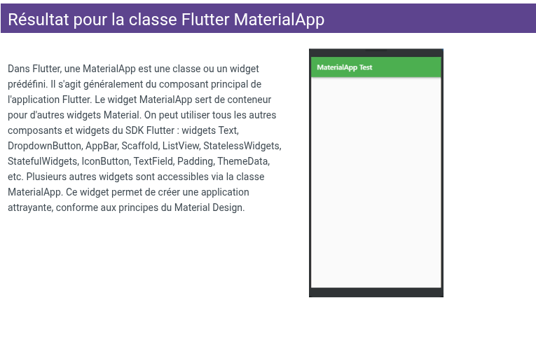


## Widget de tiroir

```dart
import 'package:flutter/material.dart';

void main() => runApp(const MyApp());


class MyApp extends StatelessWidget {
  final appTitle = 'Flutter Drawer Demo';

  const MyApp({ super.key });

  @override
  Widget build(BuildContext context) {
    return MaterialApp(
      title: appTitle,
      home: MyHomePage(title: appTitle),
    );
  }
}


class MyHomePage extends StatelessWidget {
  final String title;

  const MyHomePage({ super.key, required this.title});

  @override
  Widget build(BuildContext context) {
    return Scaffold(
      appBar: AppBar(
        title: Text(title),
        backgroundColor: Colors.green,
      ),

      body: const Center(
        child: Text(
          'A drawer is an invisible side screen',
          style: TextStyle(
            fontSize: 20.0
          ),
        )
      ),
      drawer: Drawer(
        child: ListView(
          padding: const EdgeInsets.all(0),
          children: [
            const DrawerHeader(
              decoration: BoxDecoration(
                color: Colors.green
              ),
              child: UserAccountsDrawerHeader(
                decoration: BoxDecoration(
                  color: Colors.green
                ),
                accountName: Text(
                  "Victor Doledji as Wyn Nresh",
                  style: TextStyle(fontSize: 18)
                ), 
                accountEmail: Text('wynnresh@gmail.com'),
                currentAccountPictureSize: Size.square(50),
                currentAccountPicture: CircleAvatar(
                  backgroundColor: Color.fromARGB(255, 165, 255, 137),
                  child: Text(
                    'A',
                    style: TextStyle(
                      fontSize: 30.0,
                      color: Colors.blue
                    ),
                  ),
                ),
              ),
            ),
            ListTile(
              leading: const Icon(Icons.person),
              title: Text('My Profile'),
              onTap: () {
                Navigator.pop(context);
              },
            ),
            ListTile(
              leading: const Icon(Icons.book),
              title: Text('My Course'),
              onTap: () {
                Navigator.pop(context);
              },
            ),
            ListTile(
              leading: const Icon(Icons.workspace_premium),
              title: Text('Go Premium'),
              onTap: () {
                Navigator.pop(context);
              },
            ),
            ListTile(
              leading: const Icon(Icons.video_label),
              title: Text('Saved Videos'),
              onTap: () {
                Navigator.pop(context);
              },
            ),
            ListTile(
              leading: const Icon(Icons.edit),
              title: Text('Edit Profile'),
              onTap: () {
                Navigator.pop(context);
              },
            ),
            ListTile(
              leading: const Icon(Icons.logout),
              title: Text('Logout'),
              onTap: () {
                Navigator.pop(context);
              },
            ),
          ],
        ),
      ),
    );
  }
}
```

- rendu

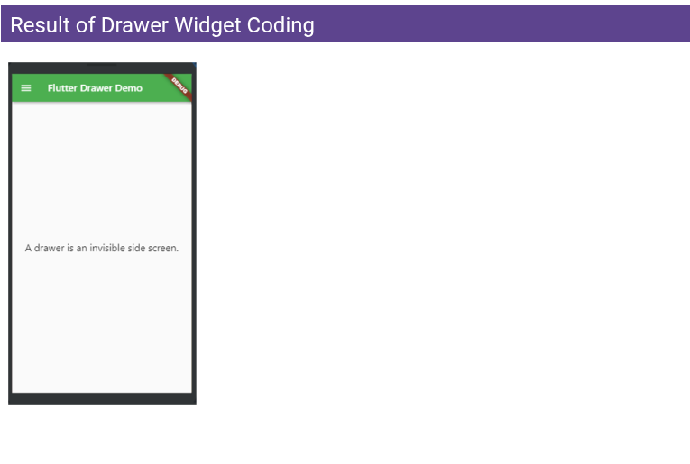


## Composant AppBar Flutter

L'AppBar est généralement le composant le plus haut (ou le plus bas) de l'application ; elle comprend la barre d'outils et plusieurs boutons d'action courants. Puisque chaque composant d'une application Flutter est un widget ou une collection de widgets, l'AppBar est également une classe ou un widget intégré à Flutter qui fournit ses fonctionnalités. Le widget AppBar est basé sur Material Design. La plupart des informations concernant l'emplacement d'affichage du contenu de l'AppBar sont déjà fournies par d'autres classes, telles que MediaQuery et Scaffold. Bien que la classe AppBar soit polyvalente et facilement personnalisable, il est également possible d'utiliser le widget SliverAppBar pour ajouter la possibilité de faire défiler la barre d'application. On peut aussi concevoir sa propre AppBar dès le départ.

```dart
import 'package:flutter/material.dart';
import 'package:flutter/services.dart';

void main() => runApp(gfgApp());


MaterialApp gfgApp() {
  return MaterialApp(
    home: Scaffold(
      appBar: AppBar(
        title: const Text('appBar test'),
        actions: <Widget>[
          IconButton(
            onPressed: () {}, 
            icon: Icon(Icons.comment),
            tooltip: 'Comment Icon',
          ),
          IconButton(
            onPressed: () {}, 
            icon: Icon(Icons.settings),
            tooltip: 'Setings Icon',
          ),
        ],
        backgroundColor: Colors.greenAccent[400],
        elevation: 50.0,
        leading: IconButton(
          onPressed: () {}, 
          icon: Icon(Icons.menu),
          tooltip: 'Menu Icon',
        ),
        systemOverlayStyle: SystemUiOverlayStyle.light,
      ),

      body: const Center(
        child: Text(
          'Using App Widget'
        ),
      )
    ),
  );
}
```

- rendu

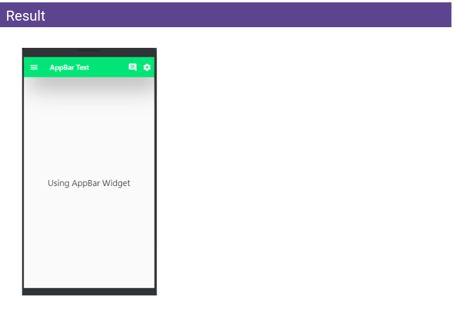


## Widget Flutter RichText

Le widget RichText permet d'afficher du texte de différentes manières. Le texte affiché est représenté sous forme d'arborescence d'objets TextSpan, chacun ayant son propre style. Selon les contraintes de mise en page, le texte peut s'afficher sur plusieurs lignes ou sur une seule

```dart
import 'package:flutter/material.dart';

void main() => runApp(const MyApp());


class MyApp extends StatelessWidget {
  const MyApp({ super.key});

  @override
  Widget build(BuildContext context) {
    return MaterialApp(
      title: 'ClipOval',
      theme: ThemeData(
        primarySwatch: Colors.blue
      ),
      home: const MyHomePAGE(),
      debugShowCheckedModeBanner: false,
    );
  }
}

class MyHomePAGE extends StatefulWidget {
  const MyHomePAGE({super.key});

  @override
  // ignore: library_private_types_in_public_api
  _MyHomePAGEState createState() => _MyHomePAGEState();
}


class _MyHomePAGEState extends State<MyHomePAGE> {
  @override
  Widget build(BuildContext context) {
    return Scaffold(
      appBar: AppBar(
        title: const Text('RichText text'),
        backgroundColor: Colors.green,
      ),

      body: Center(
        child: RichText(
          overflow: TextOverflow.clip,
          textAlign: TextAlign.end,
          textDirection: TextDirection.rtl,
          softWrap: true,
          maxLines: 1,
          text: TextSpan(
            text: 'Rich',
            style: DefaultTextStyle.of(context).style,
            children: <TextSpan>[
              TextSpan(
                text: 'Text',
                style: TextStyle(fontWeight: FontWeight.bold)
              )
            ]
          ), 
          textScaler: TextScaler.linear(1)
        )
      ),
      backgroundColor: Colors.lightBlue[50],
    );
  }
}

class MyClip extends CustomClipper<Rect> {
  @override
  Rect getClip(Size size) {
    return const Rect.fromLTWH(0, 0, 100, 100);
  }

  @override
  bool shouldReclip(CustomClipper<Rect> oldClipper) {
    return false;
  }
}
```

Onglets Flutter
Les onglets sont exactement ce que leur nom indique. Lorsqu'un utilisateur clique dessus, il navigue entre différentes pages. L'utilisation des onglets est courante dans les programmes. Grâce à la bibliothèque Material Design, Flutter simplifie la création d'interfaces à onglets. Nous allons ici explorer ce sujet en détail.
Développement d'une application basique (avec 5 onglets) en Flutter
Développons une application basique avec 5 onglets pour mieux comprendre la notion d'onglets et leur fonctionnement dans une application Flutter en suivant les étapes ci-dessous :
Créez un TabController.
Créez des onglets dans l'application.
Remplissez chaque onglet avec du matériau.

- rendu

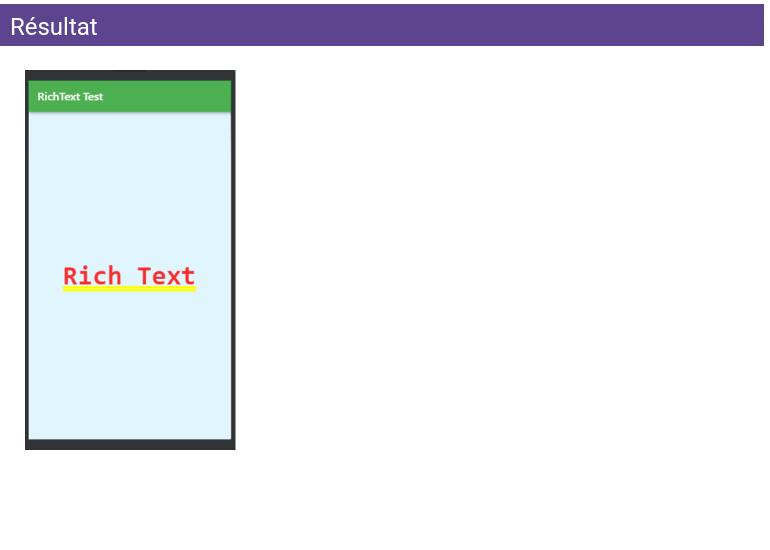


## Onglets Flutter

Onglets Flutter
Les onglets sont exactement ce que leur nom indique. Lorsqu'un utilisateur clique dessus, il navigue entre différentes pages. L'utilisation des onglets est courante dans les programmes. Grâce à la bibliothèque Material Design, Flutter simplifie la création d'interfaces à onglets. Nous allons ici explorer ce sujet en détail.

Développement d'une application basique (avec 5 onglets) en Flutter

Développons une application basique avec 5 onglets pour mieux comprendre la notion d'onglets et leur fonctionnement dans une application Flutter en suivant les étapes ci-dessous :

- Créez un TabController.
- Créez des onglets dans l'application.
- Remplissez chaque onglet avec du matériau.

### Écrire le code pour les onglets Flutter

```dart
import 'package:flutter/material.dart';

void main() => runApp(const TabBarDemo());


class TabBarDemo extends StatelessWidget {
  const TabBarDemo({super.key});

  @override
  Widget build(BuildContext context) {
    return MaterialApp(
      home: DefaultTabController(
        length: 5, 
        child: Scaffold(
          appBar: AppBar(
            bottom: const TabBar(
              tabs: [
                Tab(icon: Icon(Icons.music_note)),
                Tab(icon: Icon(Icons.music_video)),
                Tab(icon: Icon(Icons.camera_alt)),
                Tab(icon: Icon(Icons.grade)),
                Tab(icon: Icon(Icons.email)),
              ]
            ),
            title: const Text('Tabs In Flutter'),
            backgroundColor: Colors.green,
          ),

          body: const TabBarView(
            children: [
              Icon(Icons.music_note),
              Icon(Icons.music_video),
              Icon(Icons.camera_alt),
              Icon(Icons.grade),
              Icon(Icons.email)
            ]
          )
        )
      )
    );
  }
}
```

- rendu

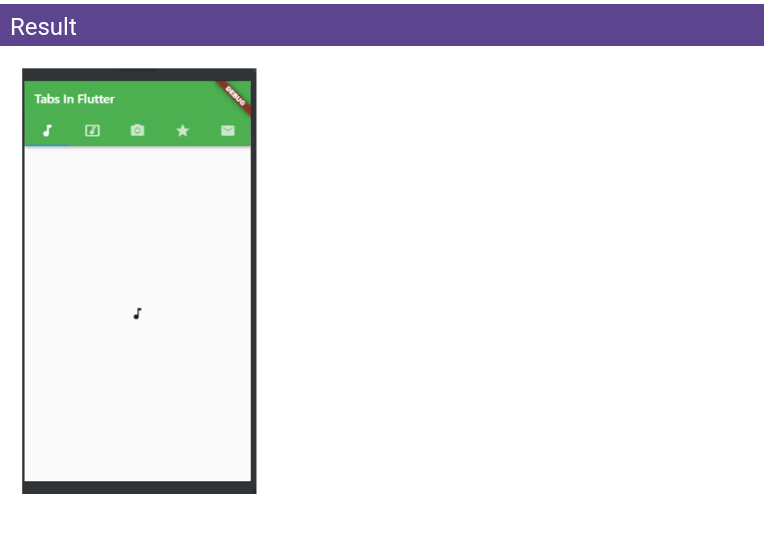


## Création d'un widget de page de contacts et Gestion d'état - Remontée d'état et rappels

```dart
import 'package:flutter/material.dart';
import 'package:ui/contact.dart';

void main() => runApp(const ContactApp());


class ContactApp extends StatelessWidget {
  const ContactApp({super.key});

  @override
  Widget build(BuildContext context) {
    return MaterialApp(
      title: 'Contacts App',
      theme: ThemeData(
        primarySwatch: Colors.blue
      ),
      home: ContactList(),
    );
  }
}


class ContactList extends StatefulWidget {
  const ContactList({super.key});

  @override
  // ignore: library_private_types_in_public_api
  _ContactListState createState() => _ContactListState();
}


// =============================
// ui/contact.dart
// =============================

import 'package:flutter/material.dart';
import 'package:data/contact.dart';

class _ContactListState extends State<ContactList> {

  // ignore: prefer_final_fields
  late List<Contact> _contacts;

  @override
  void initState() {
    super.initState();

    _contacts = List.generate(50, (index) {
      return Contact(
        name: 'Victor', 
        email: 'victorvaddely@gmail.com',
        phone: '2215579652'
      );
    });
  }

  @override
  Widget build(BuildContext context) {
    return Scaffold(
      appBar: AppBar(
        title: Text('Contacts'),
      ),

      body: Center(
        child: ListView.builder(
          itemCount: _contacts.length,
          itemBuilder: (context, index) {
            return ContactTile(
              contact: _contacts[index],
              onFavoriteToggle: (isFavorite) {
                setState(() {
                  _contacts[index].isFavorite = !_contacts[index].isFavorite;
                  _contacts.sort((a, b) {
                    if (a.isFavorite) {
                      return -1;
                    } else if (b.isFavorite) {
                      return 1;
                    }
                    return 0;
                  });
                });
              },
            );
          },
        ),
      )
    );
  }
}


// data/contact.dart

import 'package:meta/meta.dart';

class Contact {
  String name;
  String email;
  String phone;
  bool isFavorite;

  Contact({
    required this.name,
    required this.email,
    required this.phone,
    this.isFavorite = false
  });
}


// widget/contact.dart


import 'package:data/contact.dart';
import 'package:flutter/material.dart';

class ContactTile extends StatelessWidget {
  const ContactTile({
    super.key,
    required this.contact,
    required this.onFavoriteToggle,
  });

  final Contact contact;
  final Function(bool) onFavoriteToggle;

  @override
  Widget build(BuildContext context) {
    return ListTile(
      title: Text(contact.name),
      subtitle: Text(contact.email),
      trailing: IconButton(
        onPressed: () {
          onFavoriteToggle(!contact.isFavorite);
        },

        icon: Icon(
          contact.isFavorite ? Icons.star : Icons.star_border,
          color: contact.isFavorite ? Colors.amber : Colors.grey,
        )
      ),
    );
  }
}
```

### Ajout d'un ScopedModel

```dart
// 1- trouver scoped model sur le site de flutter
// 2- naviger vers l'onglet installation
// 3- puis descendre sur dependencies
// 4- copier la version
// dans notre projet coller dans pubspec.yaml sous dependencies

// dans le code

import 'package:flutter/material.dart';
import 'package:scoped_model/scoped_model.dart';
import 'package:models/contact_model.dart';
import 'package:ui/contact.dart';


void main() => runApp(const ContactApp());


class ContactApp extends StatelessWidget {
  const ContactApp({super.key});

  @override
  Widget build(BuildContext context) {
    return ScopedModel(
      model: ContactModel(),
      child: MaterialApp(
        title: 'Contacts App',
        theme: ThemeData(
          primarySwatch: Colors.blue
        ),
        home: ContactCreatePage(),
      )
    );
  }
}


class ContactList extends StatefulWidget {
  const ContactList({super.key});

  @override
  // ignore: library_private_types_in_public_api
  _ContactListState createState() => _ContactListState();
}


// ui/contact.dart

import 'package:data/contact.dart';

class _ContactListState extends State<ContactList> {


  @override
  Widget build(BuildContext context) {
    return Scaffold(
      appBar: AppBar(
        title: Text('Contacts'),
      ),

      body: ScopedModelDescendant<ContactModel>(
        builder: (context, child, model){
          return ListView.builder(
            itemCount: model.contacts.length,
            itemBuilder: (context, index) {
              return ContactTile(
                contactIndex: index,
              );
            },
          );
        }
      )
    );
  }
}


// data/contact.dart

import 'package:meta/meta.dart';

class Contact {
  String name;
  String email;
  String phone;
  bool isFavorite;

  Contact({
    required this.name,
    required this.email,
    required this.phone,
    this.isFavorite = false
  });
}


// widget/contact.dart

import 'package:data/contact.dart';

class ContactTile extends StatelessWidget {
  const ContactTile({
    super.key,
    required this.contactIndex,
  });

  final int contactIndex;

  @override
  Widget build(BuildContext context) {
    return ScopedModelDescendant<ContactModel>(
      builder: (context, child, model) {
        final displayedContact = model.contacts[contactIndex];

        return ListTile(
          title: Text(displayedContact.name),
          subtitle: Text(displayedContact.email),
          trailing: IconButton(
            onPressed: () {
              model.changeFavoriteStatus(contactIndex);
            },

            icon: Icon(
              displayedContact.isFavorite ? Icons.star : Icons.star_border,
              color:  displayedContact.isFavorite ? Colors.amber : Colors.grey,
            )
          ),
        );
      }
    );
  }
}


// models/contact_model.dart

import 'package:scoped_model/scoped_model.dart';
import 'package:data/contact';


class ContactModel extends Model with ChangeNotifier {
  final List<Contact> _contacts = List.generate(50, (index) {
    return Contact(
      name: 'Victor', 
      email: 'victorvaddely@gmail.com',
      phone: '2215579652'
    );
  });

  List<Contact> get contacts => _contacts;

  void changeFavoriteStatus(int index) {
    _contacts[index].isFavorite = !_contacts[index].isFavorite;

    _sortContacts();
    notifyListeners();
  }

  void _sortContacts() {
    _contacts.sort((a, b) {
      int comparisonResult;
      
      comparisonResult = _compareBaseOnFavoriteStatus(a, b);

      if (comparisonResult == 0) {
        comparisonResult = _compareAlphabetically(a, b);
      }

      return comparisonResult;
    });
  }

  int _compareBaseOnFavoriteStatus(Contact a, Contact b) {
    if (a.isFavorite) {
      return -1;
    } else if (b.isFavorite) {
      return 1;
    }
    return 0;
  }

  int _compareAlphabetically(Contact a, Contact b) {
    return a.name.compareTo(b.name);
  }
}
```

### Création d'un formulaire de saisie

```dart
// ui/contact_create.dart

class ContactCreatePage extends StatelessWidget {
  const ContactCreatePage({super.key});

  @override
  Widget build(BuildContext context) {
    return Scaffold(
      appBar: AppBar(
        title: Text('Create'),
      ),
      body: ContactForm()
    );
  }
}


// ui/form

import 'package:libphonenumber/libphonenumber.dart';


class ContatctForm extends StatefulWidget {
  const ContatctForm({super.key});

  @override
  // ignore: library_private_types_in_public_api
  _ContactFormState createState() => _ContactFormState();
}


class _ContactFormState extends State<ContatctForm> {
  final _formKey = GlobalKey<FormState>();

  final _emailController = TextEditingController();

  String? _name;
  String? _email;
  String? _phone;

  @override
  void initState() {
    super.initState();
    _emailController.addListener(() {
      // Validation en temps réel
      _email = _emailController.text;
      // Faire quelque chose avec l'email
    });
  }

  @override
  void dispose() {
    _emailController.dispose();
    super.dispose();
  }


  String? _validateName(String? value) {
    if (value == null || value.isEmpty) {
      return 'Veuillez entrer un Nom';
    }

    if (value.length <= 4) {
      return 'le Nom doit etre d\'au moins 4 lettre';
    }
    return null; // Retourner null signifie que la validation a réussi
  }
  
  String? _validateEmail(String? value) {
    final emailRegExp = RegExp(r'^[\w-\.]+@([\w-]+\.)+[\w-]{2,4}$');
    
    if (value == null || value.isEmpty) {
      return 'Veuillez entrer un Email';
    }
    
    if (!emailRegExp.hasMatch(value)) {
      return 'Veuillez entrer un email valide';
    }

    return null;
  }

  String? _validatePhone(String? value) {
    if (value == null || value.isEmpty) {
      return 'Le téléphone est requis';
    }
  
    // Pour la France (FR)
    bool isValid = PhoneNumberUtil.isValidPhoneNumber(
      phoneNumber: value,
      isoCode: 'FR',
    );
  
    if (!isValid) {
      return 'Numéro de téléphone invalide';
    }
  
    return null;
  }

  @override
  Widget build(BuildContext context) {
    return Form(
      key: _formKey,
      child: ListView(
        children: <Widget>[
          SizedBox(
            height: 10,
          ),
          
          TextFormField(
            onSaved: (value) => _name = value,
            validator: _validateName,
            
            decoration: InputDecoration(
              labelText: 'Name',
              border: OutlineInputBorder(
                borderRadius: BorderRadius.circular(5)
              ),
              prefixIcon: Icon(Icons.person),
            ),
          ),
          
          SizedBox(
            height: 10,
          ),
          
          TextFormField(
            controller: _emailController,
            validator: _validateEmail,
            onSaved: (value) => _email = value,
            
            decoration: InputDecoration(
              labelText: 'Email',
              border: OutlineInputBorder(
                borderRadius: BorderRadius.circular(5)
              ),
              prefixIcon: Icon(Icons.email),
              hintText: 'exemple@domaine.com',
            ),
            
            keyboardType: TextInputType.emailAddress,
          ),
          
          SizedBox(
            height: 10,
          ),
          
          TextFormField(
            validator: _validatePhone,
            onSaved: (value) => _phone = value,
            
            decoration: InputDecoration(
              labelText: 'Phone',
              border: OutlineInputBorder(
                borderRadius: BorderRadius.circular(5)
              ),
              prefixIcon: Icon(Icons.phone),
              hintText: '+2250612345678',
            ),
            
            keyboardType: TextInputType.phone,
          ),
          
          SizedBox(
            height: 10,
          ),
          
          ElevatedButton(
            onPressed: () {
              if (_formKey.currentState!.validate()) {
                _formKey.currentState!.save();

                ScaffoldMessenger.of(context).showSnackBar(
                  SnackBar(
                    content: Text('Contact créé avec succès!'),
                    backgroundColor: Colors.green,
                  ),
                );
                
                // ignore: avoid_print
                print('Name: $_name, Email: $_email, Phone: $_phone');
              }
            },
            
            style: ElevatedButton.styleFrom(
              backgroundColor: Theme.of(context).primaryColor,
              minimumSize: Size(double.infinity, 50),
              shape: RoundedRectangleBorder(
                borderRadius: BorderRadius.circular(10),
              ),
            ),
            
            child: Row(
              mainAxisAlignment: MainAxisAlignment.center,
              children: [
                Icon(
                  Icons.person, 
                  size: 18,
                ),
                Text(
                  'Create Contact',
                  style: TextStyle(
                    color: Colors.white,
                    fontSize: 18
                  ),
                ),
              ]
            )
          )
        ],
      )
    );
  }
}

```

### Ajout de nouveaux contacts au modèle de contacts

```dart
class ContactModel extends Model with ChangeNotifier {
  final List<Contact> _contacts = List.generate(50, (index) {
    return Contact(
      name: 'Victor', 
      email: 'victorvaddely@gmail.com',
      phone: '2215579652'
    );
  });

  List<Contact> get contacts => _contacts;

  void changeFavoriteStatus(int index) {
    _contacts[index].isFavorite = !_contacts[index].isFavorite;

    _sortContacts();
    notifyListeners();
  }

  void _sortContacts() {
    _contacts.sort((a, b) {
      int comparisonResult;
      
      comparisonResult = _compareBaseOnFavoriteStatus(a, b);

      if (comparisonResult == 0) {
        comparisonResult = _compareAlphabetically(a, b);
      }

      return comparisonResult;
    });
  }


  void addContact(Contact contact) {
    _contacts.add(contact);
    notifyListeners();
  }

  int _compareBaseOnFavoriteStatus(Contact a, Contact b) {
    if (a.isFavorite) {
      return -1;
    } else if (b.isFavorite) {
      return 1;
    }
    return 0;
  }

  int _compareAlphabetically(Contact a, Contact b) {
    return a.name.compareTo(b.name);
  }
}
```

### Mise en œuvre de la sauvegarde du formulaire

```dart
class _ContactFormState extends State<ContatctForm> {
  final _formKey = GlobalKey<FormState>();

  final _emailController = TextEditingController();

  String? _name;
  String? _email;
  String? _phone;

  @override
  void initState() {
    super.initState();
    _emailController.addListener(() {
      // Validation en temps réel
      _email = _emailController.text;
      // Faire quelque chose avec l'email
    });
  }

  @override
  void dispose() {
    _emailController.dispose();
    super.dispose();
  }


  String? _validateName(String? value) {
    if (value == null || value.isEmpty) {
      return 'Veuillez entrer un Nom';
    }

    if (value.length <= 4) {
      return 'le Nom doit etre d\'au moins 4 lettre';
    }
    return null; // Retourner null signifie que la validation a réussi
  }
  

  String? _validateEmail(String? value) {
    final emailRegExp = RegExp(r'^[\w-\.]+@([\w-]+\.)+[\w-]{2,4}$');
    
    if (value == null || value.isEmpty) {
      return 'Veuillez entrer un Email';
    }
    
    if (!emailRegExp.hasMatch(value)) {
      return 'Veuillez entrer un email valide';
    }

    return null;
  }


  String? _validatePhone(String? value) {
    if (value == null || value.isEmpty) {
      return 'Le téléphone est requis';
    }
  
    // Pour la France (FR)
    bool isValid = PhoneNumberUtil.isValidPhoneNumber(
      phoneNumber: value,
      isoCode: 'FR',
    );
  
    if (!isValid) {
      return 'Numéro de téléphone invalide';
    }
  
    return null;
  }

  @override
  Widget build(BuildContext context) {
    return Form(
      key: _formKey,
      child: ListView(
        children: <Widget>[
          SizedBox(
            height: 10,
          ),
          
          TextFormField(
            onSaved: (value) => _name = value,
            validator: _validateName,
            
            decoration: InputDecoration(
              labelText: 'Name',
              border: OutlineInputBorder(
                borderRadius: BorderRadius.circular(5)
              ),
              prefixIcon: Icon(Icons.person),
            ),
          ),
          
          SizedBox(
            height: 10,
          ),
          
          TextFormField(
            controller: _emailController,
            validator: _validateEmail,
            onSaved: (value) => _email = value,
            
            decoration: InputDecoration(
              labelText: 'Email',
              border: OutlineInputBorder(
                borderRadius: BorderRadius.circular(5)
              ),
              prefixIcon: Icon(Icons.email),
              hintText: 'exemple@domaine.com',
            ),
            
            keyboardType: TextInputType.emailAddress,
          ),
          
          SizedBox(
            height: 10,
          ),
          
          TextFormField(
            validator: _validatePhone,
            onSaved: (value) => _phone = value,
            
            decoration: InputDecoration(
              labelText: 'Phone',
              border: OutlineInputBorder(
                borderRadius: BorderRadius.circular(5)
              ),
              prefixIcon: Icon(Icons.phone),
              hintText: '+2250612345678',
            ),
            
            keyboardType: TextInputType.phone,
          ),
          
          SizedBox(
            height: 10,
          ),
          
          ElevatedButton(
            onPressed: _onSaveContactButtonPressed,
            
            style: ElevatedButton.styleFrom(
              backgroundColor: Theme.of(context).primaryColor,
              minimumSize: Size(double.infinity, 50),
              shape: RoundedRectangleBorder(
                borderRadius: BorderRadius.circular(10),
              ),
            ),
            
            child: Row(
              mainAxisAlignment: MainAxisAlignment.center,
              children: [
                Icon(
                  Icons.person, 
                  size: 18,
                ),
                Text(
                  'Create Contact',
                  style: TextStyle(
                    color: Colors.white,
                    fontSize: 18
                  ),
                ),
              ]
            )
          )
        ],
      )
    );
  }

  void _onSaveContactButtonPressed() {
    if (_formKey.currentState!.validate()) {
      _formKey.currentState!.save();

      ScaffoldMessenger.of(context).showSnackBar(
        SnackBar(
          content: Text('Contact créé avec succès!'),
          backgroundColor: Colors.green,
        ),
      );

      final newContact = Contact(
        name: _name!, 
        email: _email!, 
        phone: _phone!
      );

      ScopedModel.of<ContactModel>(context).addContact(newContact);
                
      // ignore: avoid_print
      print('Name: $_name, Email: $_email, Phone: $_phone');
    }
  }
}
```

## Ajout d'un bouton d'action flottant pour la navigation à l'aide de MaterialPageRoute

```dart
import 'package:data/contact.dart';

class _ContactListState extends State<ContactList> {


  @override
  Widget build(BuildContext context) {
    return Scaffold(
      appBar: AppBar(
        title: Text('Contacts'),
      ),

      body: ScopedModelDescendant<ContactModel>(
        builder: (context, child, model){
          return ListView.builder(
            itemCount: model.contacts.length,
            itemBuilder: (context, index) {
              return ContactTile(
                contactIndex: index,
              );
            },
          );
        }
      ),
      floatingActionButton: FloatingActionButton(
        onPressed: () {
          Navigator.of(context).push(
            MaterialPageRoute(
              builder: (_) => ContactCreatePage()
            )
          );
        },
        child: Icon(Icons.person_add)
      ),
    );
  }
}
```

## Création d'une page de modification de contact

```dart
// widget/contact.dart

import 'package:data/contact.dart';

class ContactTile extends StatelessWidget {
  const ContactTile({
    super.key,
    required this.contactIndex,
  });

  final int contactIndex;

  @override
  Widget build(BuildContext context) {
    return ScopedModelDescendant<ContactModel>(
      builder: (context, child, model) {
        final displayedContact = model.contacts[contactIndex];

        return ListTile(
          title: Text(displayedContact.name),
          subtitle: Text(displayedContact.email),
          trailing: IconButton(
            onPressed: () {
              model.changeFavoriteStatus(contactIndex);
            },

            icon: Icon(
              displayedContact.isFavorite ? Icons.star : Icons.star_border,
              color:  displayedContact.isFavorite ? Colors.amber : Colors.grey,
            )
          ),
          onTap: () {
            Navigator.of(context).push(
              MaterialPageRoute(
                builder: (_) => ContactUpdatePage(
                  updatedContact: displayedContact, 
                  updatedConatctIndex: contactIndex
                )
              )
            );
          },
        );
      }
    );
  }
}


// models/contact_model.dart

import 'package:scoped_model/scoped_model.dart';
import 'package:data/contact';


class ContactModel extends Model with ChangeNotifier {
  final List<Contact> _contacts = List.generate(50, (index) {
    return Contact(
      name: 'Victor', 
      email: 'victorvaddely@gmail.com',
      phone: '2215579652'
    );
  });

  List<Contact> get contacts => _contacts;

  void changeFavoriteStatus(int index) {
    _contacts[index].isFavorite = !_contacts[index].isFavorite;

    _sortContacts();
    notifyListeners();
  }

  void _sortContacts() {
    _contacts.sort((a, b) {
      int comparisonResult;
      
      comparisonResult = _compareBaseOnFavoriteStatus(a, b);

      if (comparisonResult == 0) {
        comparisonResult = _compareAlphabetically(a, b);
      }

      return comparisonResult;
    });
  }


  void addContact(Contact contact) {
    _contacts.add(contact);
    notifyListeners();
  }

  void updatedContact(Contact contact, int contactIndex) {
    _contacts[contactIndex] = contact;
    notifyListeners();
  }

  int _compareBaseOnFavoriteStatus(Contact a, Contact b) {
    if (a.isFavorite) {
      return -1;
    } else if (b.isFavorite) {
      return 1;
    }
    return 0;
  }

  int _compareAlphabetically(Contact a, Contact b) {
    return a.name.compareTo(b.name);
  }
}

// ui/form

import 'package:libphonenumber/libphonenumber.dart';


class ContatctForm extends StatefulWidget {
  final Contact? updatedContact;
  final int? updatedConatctIndex;

  const ContatctForm({
    super.key,
    this.updatedContact,
    this.updatedConatctIndex
  });

  @override
  // ignore: library_private_types_in_public_api
  _ContactFormState createState() => _ContactFormState();
}


class _ContactFormState extends State<ContatctForm> {
  final _formKey = GlobalKey<FormState>();

  final _emailController = TextEditingController();

  String? _name;
  String? _email;
  String? _phone;

  bool get isUpdatedMode => widget.updatedContact != null;

  @override
  void initState() {
    super.initState();
    _emailController.addListener(() {
      // Validation en temps réel
      _email = _emailController.text;
      // Faire quelque chose avec l'email
    });
  }

  @override
  void dispose() {
    _emailController.dispose();
    super.dispose();
  }


  String? _validateName(String? value) {
    if (value == null || value.isEmpty) {
      return 'Veuillez entrer un Nom';
    }

    if (value.length <= 4) {
      return 'le Nom doit etre d\'au moins 4 lettre';
    }
    return null; // Retourner null signifie que la validation a réussi
  }
  

  String? _validateEmail(String? value) {
    final emailRegExp = RegExp(r'^[\w-\.]+@([\w-]+\.)+[\w-]{2,4}$');
    
    if (value == null || value.isEmpty) {
      return 'Veuillez entrer un Email';
    }
    
    if (!emailRegExp.hasMatch(value)) {
      return 'Veuillez entrer un email valide';
    }

    return null;
  }


  String? _validatePhone(String? value) {
    if (value == null || value.isEmpty) {
      return 'Le téléphone est requis';
    }
  
    // Pour la France (FR)
    bool isValid = PhoneNumberUtil.isValidPhoneNumber(
      phoneNumber: value,
      isoCode: 'FR',
    );
  
    if (!isValid) {
      return 'Numéro de téléphone invalide';
    }
  
    return null;
  }

  @override
  Widget build(BuildContext context) {
    return Form(
      key: _formKey,
      child: ListView(
        children: <Widget>[
          SizedBox(
            height: 10,
          ),
          
          TextFormField(
            onSaved: (value) => _name = value,
            validator: _validateName,
            initialValue: widget.updatedContact?.name,
            
            decoration: InputDecoration(
              labelText: 'Name',
              border: OutlineInputBorder(
                borderRadius: BorderRadius.circular(5)
              ),
              prefixIcon: Icon(Icons.person),
            ),
          ),
          
          SizedBox(
            height: 10,
          ),
          
          TextFormField(
            controller: _emailController,
            validator: _validateEmail,
            onSaved: (value) => _email = value,
            initialValue: widget.updatedContact?.email,
            
            decoration: InputDecoration(
              labelText: 'Email',
              border: OutlineInputBorder(
                borderRadius: BorderRadius.circular(5)
              ),
              prefixIcon: Icon(Icons.email),
              hintText: 'exemple@domaine.com',
            ),
            
            keyboardType: TextInputType.emailAddress,
          ),
          
          SizedBox(
            height: 10,
          ),
          
          TextFormField(
            validator: _validatePhone,
            onSaved: (value) => _phone = value,
            initialValue: widget.updatedContact?.phone,
            
            decoration: InputDecoration(
              labelText: 'Phone',
              border: OutlineInputBorder(
                borderRadius: BorderRadius.circular(5)
              ),
              prefixIcon: Icon(Icons.phone),
              hintText: '+2250612345678',
            ),
            
            keyboardType: TextInputType.phone,
          ),
          
          SizedBox(
            height: 10,
          ),
          
          ElevatedButton(
            onPressed: _onSaveContactButtonPressed,
            
            style: ElevatedButton.styleFrom(
              backgroundColor: Theme.of(context).primaryColor,
              minimumSize: Size(double.infinity, 50),
              shape: RoundedRectangleBorder(
                borderRadius: BorderRadius.circular(10),
              ),
            ),
            
            child: Row(
              mainAxisAlignment: MainAxisAlignment.center,
              children: [
                Icon(
                  Icons.person, 
                  size: 18,
                ),
                Text(
                  'Create Contact',
                  style: TextStyle(
                    color: Colors.white,
                    fontSize: 18
                  ),
                ),
              ]
            )
          )
        ],
      )
    );
  }

  void _onSaveContactButtonPressed() {
    if (_formKey.currentState!.validate()) {
      _formKey.currentState!.save();

      ScaffoldMessenger.of(context).showSnackBar(
        SnackBar(
          content: Text('Contact créé avec succès!'),
          backgroundColor: Colors.green,
        ),
      );

      final newContact = Contact(
        name: _name!, 
        email: _email!, 
        phone: _phone!,
        isFavorite: widget.updatedContact?.isFavorite ?? false
      );

      if (isUpdatedMode) {
        ScopedModel.of<ContactModel>(context).addContact(
          newContact,
          widget.updatedConatctIndex
        );
      } else {
        ScopedModel.of<ContactModel>(context).addContact(newContact);
      }

      // revenir a la page precedente
      Navigator.of(context).pop();
                
      // ignore: avoid_print
      print('Name: $_name, Email: $_email, Phone: $_phone');
    }
  }
}


class ContactUpdatePage extends StatelessWidget {
  final Contact updatedContact;
  final int updatedConatctIndex;

  const ContactUpdatePage({
    super.key,
    required this.updatedContact,
    required this.updatedConatctIndex
  });

  @override
  Widget build(BuildContext context) {
    return Scaffold(
      appBar: AppBar(
        title: Text('Update'),
      ),
      body: ContatctForm(
        updatedContact: updatedContact,
        updatedConatctIndex: updatedConatctIndex,
      )
    );
  }
}
```

## Rendre les éléments de la liste coulissants


coulisser pour les button supprimer modifier et autre 

```dart
// on recherche flutter slidable sur le site de flutter
// on ajout sa version a la dependance

import 'package:data/contact.dart';
import 'package:flutter_slidable/flutter_slidable.dart';


class ContactTile extends StatelessWidget {
  const ContactTile({
    super.key,
    required this.contactIndex,
  });

  final int contactIndex;

  @override
  Widget build(BuildContext context) {
    return ScopedModelDescendant<ContactModel>(
      builder: (context, child, model) {
        final displayedContact = model.contacts[contactIndex];

        return slidable(
          delegate: SlidableBehindDeletage(),
          secondaryActions: <Widget>[
            IconSlideAction(
              caption: 'Delete',
              color: Colors.red,
              icon: Icon(Icons.delete),
              onTap: () {}
            )
          ],
          child: Container(
            color: Theme.of(context).canvasColor,
            child: ListTile(
              title: Text(displayedContact.name),
              subtitle: Text(displayedContact.email),
              trailing: IconButton(
                onPressed: () {
                  model.changeFavoriteStatus(contactIndex);
                },

                icon: Icon(
                  displayedContact.isFavorite ? Icons.star : Icons.star_border,
                  color:  displayedContact.isFavorite ? Colors.amber : Colors.grey,
                )
              ),
              onTap: () {
                Navigator.of(context).push(
                  MaterialPageRoute(
                    builder: (_) => ContactUpdatePage(
                      updatedContact: displayedContact, 
                      updatedConatctIndex: contactIndex
                    )
                  )
                );
              },
            )
          )
        );
      }
    );
  }
}
```

### Création d'une fonction de construction d'assistance

```dart
import 'package:data/contact.dart';
import 'package:flutter_slidable/flutter_slidable.dart';


class ContactTile extends StatelessWidget {
  const ContactTile({
    super.key,
    required this.contactIndex,
  });

  final int contactIndex;

  @override
  Widget build(BuildContext context) {
    return ScopedModelDescendant<ContactModel>(
      builder: (context, child, model) {
        final displayedContact = model.contacts[contactIndex];

        return slidable(
          delegate: SlidableBehindDeletage(),
          secondaryActions: <Widget>[
            IconSlideAction(
              caption: 'Delete',
              color: Colors.red,
              icon: Icon(Icons.delete),
              onTap: () {}
            )
          ],
          child: _buildContent(
            context, 
            displayedContact, 
            model
          )
        );
      }
    );
  }

  Container _buildContent(BuildContext context, Contact displayedContact, ContactModel model) {
    return Container(
      color: Theme.of(context).canvasColor,
      child: ListTile(
        title: Text(displayedContact.name),
        subtitle: Text(displayedContact.email),
        trailing: IconButton(
          onPressed: () {
            model.changeFavoriteStatus(contactIndex);
          },

          icon: Icon(
            displayedContact.isFavorite ? Icons.star : Icons.star_border,
            color:  displayedContact.isFavorite ? Colors.amber : Colors.grey,
          )
        ),
        onTap: () {
          Navigator.of(context).push(
            MaterialPageRoute(
              builder: (_) => ContactUpdatePage(
                updatedContact: displayedContact, 
                updatedConatctIndex: contactIndex
              )
            )
          );
        },
      )
    );
  }
}
```

### Suppression d'un contact du modèle de contact

```dart
// widget/contact.dart

import 'package:data/contact.dart';
import 'package:flutter_slidable/flutter_slidable.dart';


class ContactTile extends StatelessWidget {
  const ContactTile({
    super.key,
    required this.contactIndex,
  });

  final int contactIndex;

  @override
  Widget build(BuildContext context) {
    return ScopedModelDescendant<ContactModel>(
      builder: (context, child, model) {
        final displayedContact = model.contacts[contactIndex];

        return slidable(
          delegate: SlidableBehindDeletage(),
          secondaryActions: <Widget>[
            IconSlideAction(
              caption: 'Delete',
              color: Colors.red,
              icon: Icon(Icons.delete),
              onTap: () {
                model.deletedContact(contactIndex);
              }
            )
          ],
          child: _buildContent(
            context, 
            displayedContact, 
            model
          )
        );
      }
    );
  }

  Container _buildContent(BuildContext context, Contact displayedContact, ContactModel model) {
    return Container(
      color: Theme.of(context).canvasColor,
      child: ListTile(
        title: Text(displayedContact.name),
        subtitle: Text(displayedContact.email),
        trailing: IconButton(
          onPressed: () {
            model.changeFavoriteStatus(contactIndex);
          },

          icon: Icon(
            displayedContact.isFavorite ? Icons.star : Icons.star_border,
            color:  displayedContact.isFavorite ? Colors.amber : Colors.grey,
          )
        ),
        onTap: () {
          Navigator.of(context).push(
            MaterialPageRoute(
              builder: (_) => ContactUpdatePage(
                updatedContact: displayedContact, 
                updatedConatctIndex: contactIndex
              )
            )
          );
        },
      )
    );
  }
}


// models/contact_model.dart

import 'package:scoped_model/scoped_model.dart';
import 'package:data/contact';


class ContactModel extends Model with ChangeNotifier {
  final List<Contact> _contacts = List.generate(50, (index) {
    return Contact(
      name: 'Victor', 
      email: 'victorvaddely@gmail.com',
      phone: '2215579652'
    );
  });

  List<Contact> get contacts => _contacts;

  void changeFavoriteStatus(int index) {
    _contacts[index].isFavorite = !_contacts[index].isFavorite;

    _sortContacts();
    notifyListeners();
  }

  void _sortContacts() {
    _contacts.sort((a, b) {
      int comparisonResult;
      
      comparisonResult = _compareBaseOnFavoriteStatus(a, b);

      if (comparisonResult == 0) {
        comparisonResult = _compareAlphabetically(a, b);
      }

      return comparisonResult;
    });
  }


  void addContact(Contact contact) {
    _contacts.add(contact);
    notifyListeners();
  }

  void deletedContact(int index) {
    _contacts.removeAt(index);
    notifyListeners();
  }

  void updatedContact(Contact contact, int contactIndex) {
    _contacts[contactIndex] = contact;
    notifyListeners();
  }

  int _compareBaseOnFavoriteStatus(Contact a, Contact b) {
    if (a.isFavorite) {
      return -1;
    } else if (b.isFavorite) {
      return 1;
    }
    return 0;
  }

  int _compareAlphabetically(Contact a, Contact b) {
    return a.name.compareTo(b.name);
  }
}
```

### Ajout d'images par défaut pour les contacts

```dart
// widget/contact.dart

import 'package:data/contact.dart';
import 'package:flutter_slidable/flutter_slidable.dart';


class ContactTile extends StatelessWidget {
  const ContactTile({
    super.key,
    required this.contactIndex,
  });

  final int contactIndex;

  @override
  Widget build(BuildContext context) {
    return ScopedModelDescendant<ContactModel>(
      builder: (context, child, model) {
        final displayedContact = model.contacts[contactIndex];

        return slidable(
          delegate: SlidableBehindDeletage(),
          secondaryActions: <Widget>[
            IconSlideAction(
              caption: 'Delete',
              color: Colors.red,
              icon: Icon(Icons.delete),
              onTap: () {
                model.deletedContact(contactIndex);
              }
            )
          ],
          child: _buildContent(
            context, 
            displayedContact, 
            model
          )
        );
      }
    );
  }

  Container _buildContent(BuildContext context, Contact displayedContact, ContactModel model) {
    return Container(
      color: Theme.of(context).canvasColor,
      child: ListTile(
        title: Text(displayedContact.name),
        subtitle: Text(displayedContact.email),
        leading: CircleAvatar(
          child: Text(displayedContact.name[0]),
        ),
        trailing: IconButton(
          onPressed: () {
            model.changeFavoriteStatus(contactIndex);
          },

          icon: Icon(
            displayedContact.isFavorite ? Icons.star : Icons.star_border,
            color:  displayedContact.isFavorite ? Colors.amber : Colors.grey,
          )
        ),
        onTap: () {
          Navigator.of(context).push(
            MaterialPageRoute(
              builder: (_) => ContactUpdatePage(
                updatedContact: displayedContact, 
                updatedConatctIndex: contactIndex
              )
            )
          );
        },
      )
    );
  }
}

// ui/form

import 'package:libphonenumber/libphonenumber.dart';


class ContatctForm extends StatefulWidget {
  final Contact? updatedContact;
  final int? updatedConatctIndex;

  const ContatctForm({
    super.key,
    this.updatedContact,
    this.updatedConatctIndex
  });

  @override
  // ignore: library_private_types_in_public_api
  _ContactFormState createState() => _ContactFormState();
}


class _ContactFormState extends State<ContatctForm> {
  final _formKey = GlobalKey<FormState>();

  final _emailController = TextEditingController();

  String? _name;
  String? _email;
  String? _phone;

  bool get isUpdatedMode => widget.updatedContact != null;

  @override
  void initState() {
    super.initState();
    _emailController.addListener(() {
      // Validation en temps réel
      _email = _emailController.text;
      // Faire quelque chose avec l'email
    });
  }

  @override
  void dispose() {
    _emailController.dispose();
    super.dispose();
  }


  String? _validateName(String? value) {
    if (value == null || value.isEmpty) {
      return 'Veuillez entrer un Nom';
    }

    if (value.length <= 4) {
      return 'le Nom doit etre d\'au moins 4 lettre';
    }
    return null; // Retourner null signifie que la validation a réussi
  }
  

  String? _validateEmail(String? value) {
    final emailRegExp = RegExp(r'^[\w-\.]+@([\w-]+\.)+[\w-]{2,4}$');
    
    if (value == null || value.isEmpty) {
      return 'Veuillez entrer un Email';
    }
    
    if (!emailRegExp.hasMatch(value)) {
      return 'Veuillez entrer un email valide';
    }

    return null;
  }


  String? _validatePhone(String? value) {
    if (value == null || value.isEmpty) {
      return 'Le téléphone est requis';
    }
  
    // Pour la France (FR)
    bool isValid = PhoneNumberUtil.isValidPhoneNumber(
      phoneNumber: value,
      isoCode: 'FR',
    );
  
    if (!isValid) {
      return 'Numéro de téléphone invalide';
    }
  
    return null;
  }

  @override
  Widget build(BuildContext context) {
    return Form(
      key: _formKey,
      child: ListView(
        children: <Widget>[
          SizedBox(
            height: 10,
          ),

          _buildContactPicture(),

          SizedBox(
            height: 10,
          ),
          
          TextFormField(
            onSaved: (value) => _name = value,
            validator: _validateName,
            initialValue: widget.updatedContact?.name,
            
            decoration: InputDecoration(
              labelText: 'Name',
              border: OutlineInputBorder(
                borderRadius: BorderRadius.circular(5)
              ),
              prefixIcon: Icon(Icons.person),
            ),
          ),
          
          SizedBox(
            height: 10,
          ),
          
          TextFormField(
            controller: _emailController,
            validator: _validateEmail,
            onSaved: (value) => _email = value,
            initialValue: widget.updatedContact?.email,
            
            decoration: InputDecoration(
              labelText: 'Email',
              border: OutlineInputBorder(
                borderRadius: BorderRadius.circular(5)
              ),
              prefixIcon: Icon(Icons.email),
              hintText: 'exemple@domaine.com',
            ),
            
            keyboardType: TextInputType.emailAddress,
          ),
          
          SizedBox(
            height: 10,
          ),
          
          TextFormField(
            validator: _validatePhone,
            onSaved: (value) => _phone = value,
            initialValue: widget.updatedContact?.phone,
            
            decoration: InputDecoration(
              labelText: 'Phone',
              border: OutlineInputBorder(
                borderRadius: BorderRadius.circular(5)
              ),
              prefixIcon: Icon(Icons.phone),
              hintText: '+2250612345678',
            ),
            
            keyboardType: TextInputType.phone,
          ),
          
          SizedBox(
            height: 10,
          ),
          
          ElevatedButton(
            onPressed: _onSaveContactButtonPressed,
            
            style: ElevatedButton.styleFrom(
              backgroundColor: Theme.of(context).primaryColor,
              minimumSize: Size(double.infinity, 50),
              shape: RoundedRectangleBorder(
                borderRadius: BorderRadius.circular(10),
              ),
            ),
            
            child: Row(
              mainAxisAlignment: MainAxisAlignment.center,
              children: [
                Icon(
                  Icons.person, 
                  size: 18,
                ),
                Text(
                  'Create Contact',
                  style: TextStyle(
                    color: Colors.white,
                    fontSize: 18
                  ),
                ),
              ]
            )
          )
        ],
      )
    );
  }

  Widget _buildContactPicture() {
    final halfScreenDiameter = MediaQuery.of(context).size.width / 2;
    
    return CircleAvatar(
      radius: halfScreenDiameter / 2,
      child: _buildCircleAvatrContent(halfScreenDiameter)
    );
  }

  Widget _buildCircleAvatrContent(double halfScreenDiameter) {
    if (isUpdatedMode) {
      return Text(
        widget.updatedContact!.name[0],
        style: TextStyle(
          fontSize: halfScreenDiameter / 2
        ),
      );
    } else {
      return Icon(
        Icons.person, 
        size: halfScreenDiameter / 2,
      );
    }
    
  }

  void _onSaveContactButtonPressed() {
    if (_formKey.currentState!.validate()) {
      _formKey.currentState!.save();

      ScaffoldMessenger.of(context).showSnackBar(
        SnackBar(
          content: Text('Contact créé avec succès!'),
          backgroundColor: Colors.green,
        ),
      );

      final newContact = Contact(
        name: _name!, 
        email: _email!, 
        phone: _phone!,
        isFavorite: widget.updatedContact?.isFavorite ?? false
      );

      if (isUpdatedMode) {
        ScopedModel.of<ContactModel>(context).addContact(
          newContact,
          widget.updatedConatctIndex
        );
      } else {
        ScopedModel.of<ContactModel>(context).addContact(newContact);
      }

      // revenir a la page precedente
      Navigator.of(context).pop();
                
      // ignore: avoid_print
      print('Name: $_name, Email: $_email, Phone: $_phone');
    }
  }
}
```

### Création d'une animation de héros

```dart
// widget/contact.dart

import 'package:data/contact.dart';
import 'package:flutter_slidable/flutter_slidable.dart';


class ContactTile extends StatelessWidget {
  const ContactTile({
    super.key,
    required this.contactIndex,
  });

  final int contactIndex;

  @override
  Widget build(BuildContext context) {
    return ScopedModelDescendant<ContactModel>(
      builder: (context, child, model) {
        final displayedContact = model.contacts[contactIndex];

        return slidable(
          delegate: SlidableBehindDeletage(),
          secondaryActions: <Widget>[
            IconSlideAction(
              caption: 'Delete',
              color: Colors.red,
              icon: Icon(Icons.delete),
              onTap: () {
                model.deletedContact(contactIndex);
              }
            )
          ],
          child: _buildContent(
            context, 
            displayedContact, 
            model
          )
        );
      }
    );
  }

  Container _buildContent(BuildContext context, Contact displayedContact, ContactModel model) {
    return Container(
      color: Theme.of(context).canvasColor,
      child: ListTile(
        title: Text(displayedContact.name),
        subtitle: Text(displayedContact.email),
        leading: _buildCircleAvatr(displayedContact),
        trailing: IconButton(
          onPressed: () {
            model.changeFavoriteStatus(contactIndex);
          },

          icon: Icon(
            displayedContact.isFavorite ? Icons.star : Icons.star_border,
            color:  displayedContact.isFavorite ? Colors.amber : Colors.grey,
          )
        ),
        onTap: () {
          Navigator.of(context).push(
            MaterialPageRoute(
              builder: (_) => ContactUpdatePage(
                updatedContact: displayedContact, 
                updatedConatctIndex: contactIndex
              )
            )
          );
        },
      )
    );
  }

  Widget _buildCircleAvatr(Contact displayedContact) {
    return Hero(
      tag: displayedContact.hashCode,
      child: CircleAvatar(
        child: Text(
          displayedContact.name[0]
        ),
      ),
    ); 
  }
}

// ui/form

import 'package:libphonenumber/libphonenumber.dart';


class ContatctForm extends StatefulWidget {
  final Contact? updatedContact;
  final int? updatedConatctIndex;

  const ContatctForm({
    super.key,
    this.updatedContact,
    this.updatedConatctIndex
  });

  @override
  // ignore: library_private_types_in_public_api
  _ContactFormState createState() => _ContactFormState();
}


class _ContactFormState extends State<ContatctForm> {
  final _formKey = GlobalKey<FormState>();

  final _emailController = TextEditingController();

  String? _name;
  String? _email;
  String? _phone;

  bool get isUpdatedMode => widget.updatedContact != null;

  @override
  void initState() {
    super.initState();
    _emailController.addListener(() {
      // Validation en temps réel
      _email = _emailController.text;
      // Faire quelque chose avec l'email
    });
  }

  @override
  void dispose() {
    _emailController.dispose();
    super.dispose();
  }


  String? _validateName(String? value) {
    if (value == null || value.isEmpty) {
      return 'Veuillez entrer un Nom';
    }

    if (value.length <= 4) {
      return 'le Nom doit etre d\'au moins 4 lettre';
    }
    return null; // Retourner null signifie que la validation a réussi
  }
  

  String? _validateEmail(String? value) {
    final emailRegExp = RegExp(r'^[\w-\.]+@([\w-]+\.)+[\w-]{2,4}$');
    
    if (value == null || value.isEmpty) {
      return 'Veuillez entrer un Email';
    }
    
    if (!emailRegExp.hasMatch(value)) {
      return 'Veuillez entrer un email valide';
    }

    return null;
  }


  String? _validatePhone(String? value) {
    if (value == null || value.isEmpty) {
      return 'Le téléphone est requis';
    }
  
    // Pour la France (FR)
    bool isValid = PhoneNumberUtil.isValidPhoneNumber(
      phoneNumber: value,
      isoCode: 'FR',
    );
  
    if (!isValid) {
      return 'Numéro de téléphone invalide';
    }
  
    return null;
  }

  @override
  Widget build(BuildContext context) {
    return Form(
      key: _formKey,
      child: ListView(
        children: <Widget>[
          SizedBox(
            height: 10,
          ),

          _buildContactPicture(),

          SizedBox(
            height: 10,
          ),
          
          TextFormField(
            onSaved: (value) => _name = value,
            validator: _validateName,
            initialValue: widget.updatedContact?.name,
            
            decoration: InputDecoration(
              labelText: 'Name',
              border: OutlineInputBorder(
                borderRadius: BorderRadius.circular(5)
              ),
              prefixIcon: Icon(Icons.person),
            ),
          ),
          
          SizedBox(
            height: 10,
          ),
          
          TextFormField(
            controller: _emailController,
            validator: _validateEmail,
            onSaved: (value) => _email = value,
            initialValue: widget.updatedContact?.email,
            
            decoration: InputDecoration(
              labelText: 'Email',
              border: OutlineInputBorder(
                borderRadius: BorderRadius.circular(5)
              ),
              prefixIcon: Icon(Icons.email),
              hintText: 'exemple@domaine.com',
            ),
            
            keyboardType: TextInputType.emailAddress,
          ),
          
          SizedBox(
            height: 10,
          ),
          
          TextFormField(
            validator: _validatePhone,
            onSaved: (value) => _phone = value,
            initialValue: widget.updatedContact?.phone,
            
            decoration: InputDecoration(
              labelText: 'Phone',
              border: OutlineInputBorder(
                borderRadius: BorderRadius.circular(5)
              ),
              prefixIcon: Icon(Icons.phone),
              hintText: '+2250612345678',
            ),
            
            keyboardType: TextInputType.phone,
          ),
          
          SizedBox(
            height: 10,
          ),
          
          ElevatedButton(
            onPressed: _onSaveContactButtonPressed,
            
            style: ElevatedButton.styleFrom(
              backgroundColor: Theme.of(context).primaryColor,
              minimumSize: Size(double.infinity, 50),
              shape: RoundedRectangleBorder(
                borderRadius: BorderRadius.circular(10),
              ),
            ),
            
            child: Row(
              mainAxisAlignment: MainAxisAlignment.center,
              children: [
                Icon(
                  Icons.person, 
                  size: 18,
                ),
                Text(
                  'Create Contact',
                  style: TextStyle(
                    color: Colors.white,
                    fontSize: 18
                  ),
                ),
              ]
            )
          )
        ],
      )
    );
  }

  Widget _buildContactPicture() {
    final halfScreenDiameter = MediaQuery.of(context).size.width / 2;
    
    return Hero(
      tag: widget.updatedContact?.hashCode ?? 0, 
      child: CircleAvatar(
        radius: halfScreenDiameter / 2,
        child: _buildCircleAvatrContent(halfScreenDiameter)
      ),
    );
  }

  Widget _buildCircleAvatrContent(double halfScreenDiameter) {
    if (isUpdatedMode) {
      return Text(
        widget.updatedContact!.name[0],
        style: TextStyle(
          fontSize: halfScreenDiameter / 2
        ),
      );
    } else {
      return Icon(
        Icons.person, 
        size: halfScreenDiameter / 2,
      );
    }
    
  }

  void _onSaveContactButtonPressed() {
    if (_formKey.currentState!.validate()) {
      _formKey.currentState!.save();

      ScaffoldMessenger.of(context).showSnackBar(
        SnackBar(
          content: Text('Contact créé avec succès!'),
          backgroundColor: Colors.green,
        ),
      );

      final newContact = Contact(
        name: _name!, 
        email: _email!, 
        phone: _phone!,
        isFavorite: widget.updatedContact?.isFavorite ?? false
      );

      if (isUpdatedMode) {
        ScopedModel.of<ContactModel>(context).addContact(
          newContact,
          widget.updatedConatctIndex
        );
      } else {
        ScopedModel.of<ContactModel>(context).addContact(newContact);
      }

      // revenir a la page precedente
      Navigator.of(context).pop();
                
      // ignore: avoid_print
      print('Name: $_name, Email: $_email, Phone: $_phone');
    }
  }
}

```

## Configuration de la bibliothèque de sélection d'images

```dart

// on recherche image picker sur le site de flutter
// et comme dab on ajoute sa version au fichier pubspec.yaml

// puis dans ios/runner/info.plist on ajout
// <key>NSPhotoLibraryUsageDescription<key/>
// <string>This app needs to access the photo library for adding contact picture.<string/> 
// <key>NSCaremaUsageDescription<key/>
// <string>This app needs to access for taking camera picture <string/>

// data/contact.dart

import 'package:meta/meta.dart';

class Contact {
  String name;
  String email;
  String phone;
  bool isFavorite;
  File? imageFile;

  Contact({
    required this.name,
    required this.email,
    required this.phone,
    this.isFavorite = false,
    this.imageFile,
  });
}


// widget/contact.dart

import 'package:data/contact.dart';
import 'package:flutter_slidable/flutter_slidable.dart';


class ContactTile extends StatelessWidget {
  const ContactTile({
    super.key,
    required this.contactIndex,
  });

  final int contactIndex;

  @override
  Widget build(BuildContext context) {
    return ScopedModelDescendant<ContactModel>(
      builder: (context, child, model) {
        final displayedContact = model.contacts[contactIndex];

        return slidable(
          delegate: SlidableBehindDeletage(),
          secondaryActions: <Widget>[
            IconSlideAction(
              caption: 'Delete',
              color: Colors.red,
              icon: Icon(Icons.delete),
              onTap: () {
                model.deletedContact(contactIndex);
              }
            )
          ],
          child: _buildContent(
            context, 
            displayedContact, 
            model
          )
        );
      }
    );
  }

  Container _buildContent(BuildContext context, Contact displayedContact, ContactModel model) {
    return Container(
      color: Theme.of(context).canvasColor,
      child: ListTile(
        title: Text(displayedContact.name),
        subtitle: Text(displayedContact.email),
        leading: _buildCircleAvatr(displayedContact),
        trailing: IconButton(
          onPressed: () {
            model.changeFavoriteStatus(contactIndex);
          },

          icon: Icon(
            displayedContact.isFavorite ? Icons.star : Icons.star_border,
            color:  displayedContact.isFavorite ? Colors.amber : Colors.grey,
          )
        ),
        onTap: () {
          Navigator.of(context).push(
            MaterialPageRoute(
              builder: (_) => ContactUpdatePage(
                updatedContact: displayedContact, 
                updatedConatctIndex: contactIndex
              )
            )
          );
        },
      )
    );
  }

  Widget _buildCircleAvatr(Contact displayedContact) {
    return Hero(
      tag: displayedContact.hashCode,
      child: CircleAvatar(
        child: _buildCircleAvatarContent(displayedContact),
      ),
    ); 
  }

  Widget _buildCircleAvatarContent(Contact displayedContact) {
    if (displayedContact.imageFile == null) {
      return Text(
        displayedContact.name[0]
      );
    } else {
      return ClipOval(
        child: AspectRatio(
          aspectRatio: 1,
          child: Image.file(
            displayedContact.imageFile!,
            fit: BoxFit.cover,
          ),
        ),
      );
    }
    
  }
}

// ui/form

import 'package:libphonenumber/libphonenumber.dart';
import 'package:image_picker/image_picker.dart';
import 'dart:io';


class ContatctForm extends StatefulWidget {
  final Contact? updatedContact;
  final int? updatedConatctIndex;

  const ContatctForm({
    super.key,
    this.updatedContact,
    this.updatedConatctIndex
  });

  @override
  // ignore: library_private_types_in_public_api
  _ContactFormState createState() => _ContactFormState();
}


class _ContactFormState extends State<ContatctForm> {
  final _formKey = GlobalKey<FormState>();

  final _emailController = TextEditingController();

  String? _name;
  String? _email;
  String? _phone;
  File? _contactImageFile;

  bool get isUpdatedMode => widget.updatedContact != null;
  bool get hasSelectedCustomImage => _contactImageFile != null;

  @override
  void initState() {
    super.initState();
    _emailController.addListener(() {
      // Validation en temps réel
      _email = _emailController.text;
      // Faire quelque chose avec l'email
    });
  }

  @override
  void dispose() {
    _emailController.dispose();
    super.dispose();
  }


  String? _validateName(String? value) {
    if (value == null || value.isEmpty) {
      return 'Veuillez entrer un Nom';
    }

    if (value.length <= 4) {
      return 'le Nom doit etre d\'au moins 4 lettre';
    }
    return null; // Retourner null signifie que la validation a réussi
  }
  

  String? _validateEmail(String? value) {
    final emailRegExp = RegExp(r'^[\w-\.]+@([\w-]+\.)+[\w-]{2,4}$');
    
    if (value == null || value.isEmpty) {
      return 'Veuillez entrer un Email';
    }
    
    if (!emailRegExp.hasMatch(value)) {
      return 'Veuillez entrer un email valide';
    }

    return null;
  }


  String? _validatePhone(String? value) {
    if (value == null || value.isEmpty) {
      return 'Le téléphone est requis';
    }
  
    // Pour la France (FR)
    bool isValid = PhoneNumberUtil.isValidPhoneNumber(
      phoneNumber: value,
      isoCode: 'FR',
    );
  
    if (!isValid) {
      return 'Numéro de téléphone invalide';
    }
  
    return null;
  }

  @override
  Widget build(BuildContext context) {
    return Form(
      key: _formKey,
      child: ListView(
        children: <Widget>[
          SizedBox(
            height: 10,
          ),

          _buildContactPicture(),

          SizedBox(
            height: 10,
          ),
          
          TextFormField(
            onSaved: (value) => _name = value,
            validator: _validateName,
            initialValue: widget.updatedContact?.name,
            
            decoration: InputDecoration(
              labelText: 'Name',
              border: OutlineInputBorder(
                borderRadius: BorderRadius.circular(5)
              ),
              prefixIcon: Icon(Icons.person),
            ),
          ),
          
          SizedBox(
            height: 10,
          ),
          
          TextFormField(
            controller: _emailController,
            validator: _validateEmail,
            onSaved: (value) => _email = value,
            initialValue: widget.updatedContact?.email,
            
            decoration: InputDecoration(
              labelText: 'Email',
              border: OutlineInputBorder(
                borderRadius: BorderRadius.circular(5)
              ),
              prefixIcon: Icon(Icons.email),
              hintText: 'exemple@domaine.com',
            ),
            
            keyboardType: TextInputType.emailAddress,
          ),
          
          SizedBox(
            height: 10,
          ),
          
          TextFormField(
            validator: _validatePhone,
            onSaved: (value) => _phone = value,
            initialValue: widget.updatedContact?.phone,
            
            decoration: InputDecoration(
              labelText: 'Phone',
              border: OutlineInputBorder(
                borderRadius: BorderRadius.circular(5)
              ),
              prefixIcon: Icon(Icons.phone),
              hintText: '+2250612345678',
            ),
            
            keyboardType: TextInputType.phone,
          ),
          
          SizedBox(
            height: 10,
          ),
          
          ElevatedButton(
            onPressed: _onSaveContactButtonPressed,
            
            style: ElevatedButton.styleFrom(
              backgroundColor: Theme.of(context).primaryColor,
              minimumSize: Size(double.infinity, 50),
              shape: RoundedRectangleBorder(
                borderRadius: BorderRadius.circular(10),
              ),
            ),
            
            child: Row(
              mainAxisAlignment: MainAxisAlignment.center,
              children: [
                Icon(
                  Icons.person, 
                  size: 18,
                ),
                Text(
                  'Create Contact',
                  style: TextStyle(
                    color: Colors.white,
                    fontSize: 18
                  ),
                ),
              ]
            )
          )
        ],
      )
    );
  }

  Widget _buildContactPicture() {
    final halfScreenDiameter = MediaQuery.of(context).size.width / 2;
    
    return Hero(
      tag: widget.updatedContact?.hashCode ?? 0, 
      child: GestureDetector(
        onTap: _onContactPictureTapped,
        child: CircleAvatar(
          radius: halfScreenDiameter / 2,
          child: _buildCircleAvatrContent(halfScreenDiameter)
        ),
      ),
    );
  }

  void _onContactPictureTapped() async {
    final imageFile = await ImagePicker.pickImge(source: ImageSource.gallery);
    
    setState(() {
      _contactImageFile = imageFile;
    });
  }

  Widget _buildCircleAvatrContent(double halfScreenDiameter) {
    if (isUpdatedMode || hasSelectedCustomImage) {
      return _buildUpdatedModeCircleAvatarContent(halfScreenDiameter);
    } else {
      return Icon(
        Icons.person, 
        size: halfScreenDiameter / 2,
      );
    }
    
  }

  Widget _buildUpdatedModeCircleAvatarContent(double halfScreenDiameter) {
    if (_contactImageFile == null) {
      return Text(
        widget.updatedContact!.name[0],
        style: TextStyle(
          fontSize: halfScreenDiameter / 2
        ),
      );
    } else {
      return ClipOval(
        child: AspectRatio(
          aspectRatio: 1,
          child: Image.file(
            _contactImageFile!,
            fit: BoxFit.cover,
          ),
        ) 
      );
    }
  }

  void _onSaveContactButtonPressed() {
    if (_formKey.currentState!.validate()) {
      _formKey.currentState!.save();

      ScaffoldMessenger.of(context).showSnackBar(
        SnackBar(
          content: Text('Contact créé avec succès!'),
          backgroundColor: Colors.green,
        ),
      );

      final newContact = Contact(
        name: _name!, 
        email: _email!, 
        phone: _phone!,
        isFavorite: widget.updatedContact?.isFavorite ?? false,
        imageFile: _contactImageFile
      );

      if (isUpdatedMode) {
        ScopedModel.of<ContactModel>(context).addContact(
          newContact,
          widget.updatedConatctIndex
        );
      } else {
        ScopedModel.of<ContactModel>(context).addContact(newContact);
      }

      // revenir a la page precedente
      Navigator.of(context).pop();
                
      // ignore: avoid_print
      print('Name: $_name, Email: $_email, Phone: $_phone');
    }
  }
}
```

### Pré-remplissage d'une image modifiée dans la page de modification des contacts

```dart
// ui/form

import 'package:libphonenumber/libphonenumber.dart';
import 'package:image_picker/image_picker.dart';
import 'dart:io';


class ContatctForm extends StatefulWidget {
  final Contact? updatedContact;
  final int? updatedConatctIndex;

  const ContatctForm({
    super.key,
    this.updatedContact,
    this.updatedConatctIndex
  });

  @override
  // ignore: library_private_types_in_public_api
  _ContactFormState createState() => _ContactFormState();
}


class _ContactFormState extends State<ContatctForm> {
  final _formKey = GlobalKey<FormState>();

  final _emailController = TextEditingController();

  String? _name;
  String? _email;
  String? _phone;
  File? _contactImageFile;

  bool get isUpdatedMode => widget.updatedContact != null;
  bool get hasSelectedCustomImage => _contactImageFile != null;

  @override
  void initState() {
    super.initState();
    _emailController.addListener(() {
      // Validation en temps réel
      _email = _emailController.text;
      // Faire quelque chose avec l'email
    });

    _contactImageFile = widget.updatedContact?.imageFile;
  }

  @override
  void dispose() {
    _emailController.dispose();
    super.dispose();
  }

  String? _validateName(String? value) {
    if (value == null || value.isEmpty) {
      return 'Veuillez entrer un Nom';
    }

    if (value.length <= 4) {
      return 'le Nom doit etre d\'au moins 4 lettre';
    }
    return null; // Retourner null signifie que la validation a réussi
  }
  

  String? _validateEmail(String? value) {
    final emailRegExp = RegExp(r'^[\w-\.]+@([\w-]+\.)+[\w-]{2,4}$');
    
    if (value == null || value.isEmpty) {
      return 'Veuillez entrer un Email';
    }
    
    if (!emailRegExp.hasMatch(value)) {
      return 'Veuillez entrer un email valide';
    }

    return null;
  }


  String? _validatePhone(String? value) {
    if (value == null || value.isEmpty) {
      return 'Le téléphone est requis';
    }
  
    // Pour la France (FR)
    bool isValid = PhoneNumberUtil.isValidPhoneNumber(
      phoneNumber: value,
      isoCode: 'FR',
    );
  
    if (!isValid) {
      return 'Numéro de téléphone invalide';
    }
  
    return null;
  }

  @override
  Widget build(BuildContext context) {
    return Form(
      key: _formKey,
      child: ListView(
        children: <Widget>[
          SizedBox(
            height: 10,
          ),

          _buildContactPicture(),

          SizedBox(
            height: 10,
          ),
          
          TextFormField(
            onSaved: (value) => _name = value,
            validator: _validateName,
            initialValue: widget.updatedContact?.name,
            
            decoration: InputDecoration(
              labelText: 'Name',
              border: OutlineInputBorder(
                borderRadius: BorderRadius.circular(5)
              ),
              prefixIcon: Icon(Icons.person),
            ),
          ),
          
          SizedBox(
            height: 10,
          ),
          
          TextFormField(
            controller: _emailController,
            validator: _validateEmail,
            onSaved: (value) => _email = value,
            initialValue: widget.updatedContact?.email,
            
            decoration: InputDecoration(
              labelText: 'Email',
              border: OutlineInputBorder(
                borderRadius: BorderRadius.circular(5)
              ),
              prefixIcon: Icon(Icons.email),
              hintText: 'exemple@domaine.com',
            ),
            
            keyboardType: TextInputType.emailAddress,
          ),
          
          SizedBox(
            height: 10,
          ),
          
          TextFormField(
            validator: _validatePhone,
            onSaved: (value) => _phone = value,
            initialValue: widget.updatedContact?.phone,
            
            decoration: InputDecoration(
              labelText: 'Phone',
              border: OutlineInputBorder(
                borderRadius: BorderRadius.circular(5)
              ),
              prefixIcon: Icon(Icons.phone),
              hintText: '+2250612345678',
            ),
            
            keyboardType: TextInputType.phone,
          ),
          
          SizedBox(
            height: 10,
          ),
          
          ElevatedButton(
            onPressed: _onSaveContactButtonPressed,
            
            style: ElevatedButton.styleFrom(
              backgroundColor: Theme.of(context).primaryColor,
              minimumSize: Size(double.infinity, 50),
              shape: RoundedRectangleBorder(
                borderRadius: BorderRadius.circular(10),
              ),
            ),
            
            child: Row(
              mainAxisAlignment: MainAxisAlignment.center,
              children: [
                Icon(
                  Icons.person, 
                  size: 18,
                ),
                Text(
                  'Create Contact',
                  style: TextStyle(
                    color: Colors.white,
                    fontSize: 18
                  ),
                ),
              ]
            )
          )
        ],
      )
    );
  }

  Widget _buildContactPicture() {
    final halfScreenDiameter = MediaQuery.of(context).size.width / 2;
    
    return Hero(
      tag: widget.updatedContact?.hashCode ?? 0, 
      child: GestureDetector(
        onTap: _onContactPictureTapped,
        child: CircleAvatar(
          radius: halfScreenDiameter / 2,
          child: _buildCircleAvatrContent(halfScreenDiameter)
        ),
      ),
    );
  }

  void _onContactPictureTapped() async {
    final imageFile = await ImagePicker.pickImge(source: ImageSource.gallery);
    
    setState(() {
      _contactImageFile = imageFile;
    });
  }

  Widget _buildCircleAvatrContent(double halfScreenDiameter) {
    if (isUpdatedMode || hasSelectedCustomImage) {
      return _buildUpdatedModeCircleAvatarContent(halfScreenDiameter);
    } else {
      return Icon(
        Icons.person, 
        size: halfScreenDiameter / 2,
      );
    }
    
  }

  Widget _buildUpdatedModeCircleAvatarContent(double halfScreenDiameter) {
    if (_contactImageFile == null) {
      return Text(
        widget.updatedContact!.name[0],
        style: TextStyle(
          fontSize: halfScreenDiameter / 2
        ),
      );
    } else {
      return ClipOval(
        child: AspectRatio(
          aspectRatio: 1,
          child: Image.file(
            _contactImageFile!,
            fit: BoxFit.cover,
          ),
        ) 
      );
    }
  }

  void _onSaveContactButtonPressed() {
    if (_formKey.currentState!.validate()) {
      _formKey.currentState!.save();

      ScaffoldMessenger.of(context).showSnackBar(
        SnackBar(
          content: Text('Contact créé avec succès!'),
          backgroundColor: Colors.green,
        ),
      );

      final newContact = Contact(
        name: _name!, 
        email: _email!, 
        phone: _phone!,
        isFavorite: widget.updatedContact?.isFavorite ?? false,
        imageFile: _contactImageFile
      );

      if (isUpdatedMode) {
        ScopedModel.of<ContactModel>(context).addContact(
          newContact,
          widget.updatedConatctIndex
        );
      } else {
        ScopedModel.of<ContactModel>(context).addContact(newContact);
      }

      // revenir a la page precedente
      Navigator.of(context).pop();
                
      // ignore: avoid_print
      print('Name: $_name, Email: $_email, Phone: $_phone');
    }
  }
}
```

